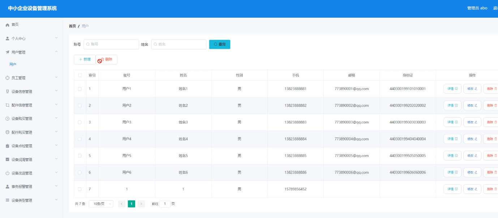
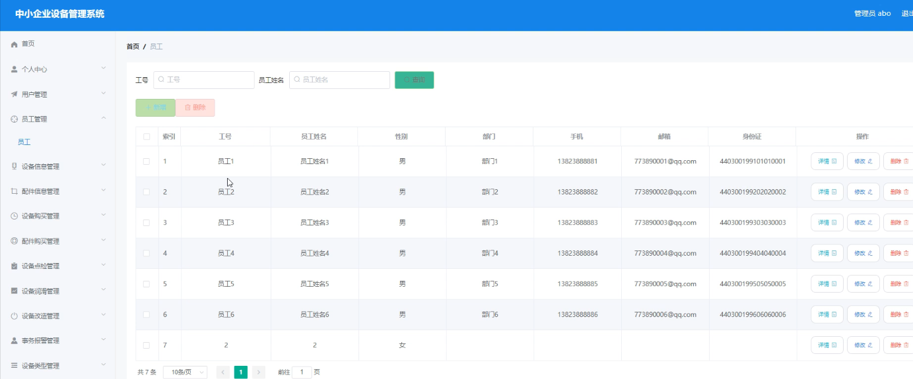
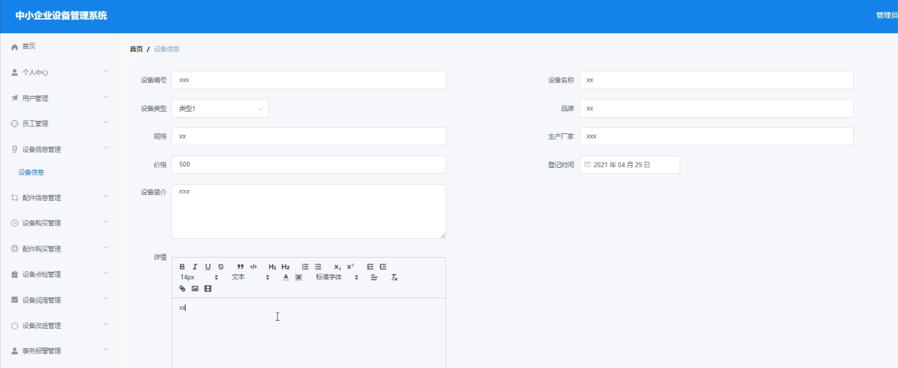
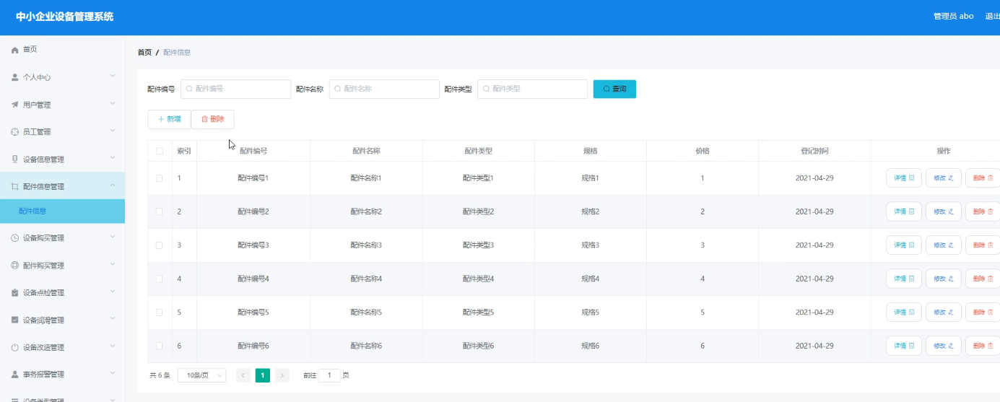
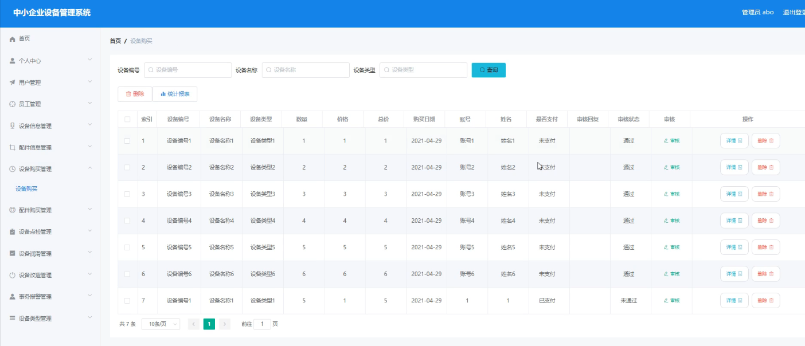

**项目简介：**  
本项目基于主流的前后端分离架构，采用 **SpringBoot + Vue 技术栈**，配套 **MySQL 数据库**，适用于毕业设计与课题实训开发。  
本人已整理了超 **4000 多套毕业设计源码+论文+开题报告+PPT...**，涵盖 **Java、SpringBoot、Vue、SSM、uni-app 小程序、PHP、Android** 等方向，支持功能修改定制与论文服务。  
**团队提供以下服务：**  
- 项目代码修改与调试  
- 数据库配置与远程协助  
- 论文定制与修改  
**获取更多的4000多套源码或SQL文件请联系：**  
- QQ：3906443360 微信：BesheHelp

## springboot090中小企业设备管理系统设计与实现

**项目简介：**  
本项目基于主流的前后端分离架构，采用 **SpringBoot + Vue 技术栈**，配套 **MySQL 数据库**，适用于毕业设计与课题实训开发。  
本人已整理了超 **4000 多套毕业设计源码+论文+开题报告+PPT...**，涵盖 **Java、SpringBoot、Vue、SSM、uni-app 小程序、PHP、Android** 等方向，支持功能修改定制与论文服务。  
**团队提供以下服务：**  
- 项目代码修改与调试  
- 数据库配置与远程协助  
- 论文定制与修改  
**获取更多的4000多套源码或SQL文件请联系：**  
- QQ：3906443360 微信：BesheHelp**

# 系统实现与系统测试

# 概念模式的设计方法是在需求分析的基础上，用概念数据模型（例如E-R模型）表示数据及数据之间的相互联系，设计出反映用户信息需求和处理需求的数据库系统概念模式。概念设计的目标是准确描述应用领域的信息模式，支持用户的各种应用，这样既容易转换为数据库系统逻辑模式，又容易为用户理解。数据库系统概念模式是面向现实世界的数据模型，不能直接用于数据库系统的实现。在此阶段，用户可以参与和评价数据库系统的设计，从而有利于保证数据库系统的设计与用户的需求相吻合。在概念模式的设计中，E-R模型法是最常见的设计方法。本系统的E-R图如下图所示：

（1）用户信息信息的实体属性图如下：

图4.12  用户信息信息实体属性图

（2）设备类型信息实体属性图如图4.13所示：

图4.13  设备类型信息实体属性图

（3）管理员信息实体属性图如图4.14所示：

图4.14 管理员信息实体属性图

4.3.2数据库设计表

中小企业设备管理系统需要后台数据库，下面介绍数据库中的各个表的详细信息：

表4.1 配件购买

表4.2 配件信息

表4.3 设备安装

表4.4设备报修

表4.5 设备点检

表4.6 设备改造

表4.7 设备购买

表4.8 设备类型

表4.9 设备润滑

表4.10 设备信息

表4.11 事务报警

表4.12 售后保养

表4.13 售后检修

表4.14 管理员信息表

表4.15 用户

表4.16 员工

5系统详细实现

5.1 用户信息管理

中小企业设备管理系统的系统管理员可以对用户信息添加修改删除以及查询操作。具体界面的展示如图5.1所示。

图5.1 用户信息管理界面

5.2 员工信息管理

管理员可以对员工信息进行添加修改删除操作。具体界面如图5.2所示。

图5.2 员工信息界面

5.3 设备信息管理

管理员可以对设备信息添加修改删除操作。界面如下图所示：

图5.3 设备信息界面

5.4 配件信息管理

管理员可以对配件信息进行添加修改删除。界面如下图所示：

图5.4 配件信息界面

5.5 设备购买管理

管理员可以对设备信息进行审核，查下，删除操作。界面如下图所示：

图5.5 设备购买管理界面

